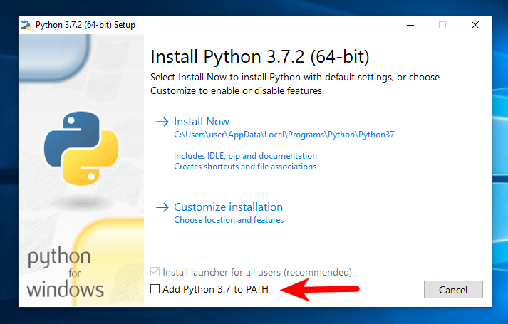

****************
Which Python 3 ?
****************

Before you start, you need to decide which Python 3 version you are going to target. Since you are migrating to an imcompatible version anyway, I advice to choose the highest version your technical constraints allow you to.

Overview of the releases
========================

Python 3.0 to 3.2
-----------------

Do not use those versions. They are very limited and badly supported.

Python 3.3, 3.4
---------------

The first Python 3 releases you could reasonably put in production. You will also find them in old linux distributions official repositories. The 3.4 is the last one to support Windows XP, if that's important to you.

Most importantly, the 3.4 is the first release to come bundled with a pip installer on non Linux systems.

While Python 3.4 introduces the excellent pathlib and asyncio libraries, they are not well integrated and full of gotchas. If you plan to use those libraries, use higher versions.

3.4 is slowly being abandonned at the same time as 2.7. NumPy 1.16 and Django 2.1 both have dropped Python 3.4 support.

Use those versions if you have no other choices.

Python 3.5
----------

This is the version you want if you work with the network a lot.

It's the first version to restore "%-formatting" for bytes, and also introduce the ``await``/``async`` keywords, making ``asyncio`` much more usable. However, if you want to use the module, make sure you can guaranty at least Python 3.5.3 as not only it sets ``TCP_NODELAY`` by default, but an important bug has been fixed on ``get_event_loop()``.

Python 3.6
----------

This version is what motivated a lot of people to start their own migration, as it's very feature rich and handy. If you can target this one, you'll get:

- a well integrated ``pathlib``, making any file system operation a breath;
- dictionaries preserve insertion order. Yes it's not official, but it won't change;
- utf8 by default on Windows;
- a well behaved ``asyncio``.
- f-string, which makes text formatting incredibly nice;

And generally many little fixes that make it so comfortable.

Because it's such a good release, some great projects such as ``black`` on supports python 3.6+. It's another good reason to target it.

It can be easier to install than you expect, as it came out in late 2016, giving time for support, so definitly check if you can.

Python 3.7
----------

The most moderne release at the time of writting, introducing goodies such as a Python debug mode, a shorter syntax for classes, and a quicker ``asyncio`` setup code.

Your project probably doesn't need those, but they are nice to have.

Installation methods for your new version of Python
=====================================================

Since choosing which version to target is related to the plateform you will dev or deploy on, let's see what are your options to install a modern Python on your machines.

If you are on Windows or Mac, the official installer are the best way to go. Alternatively, Windows 10 app store and Mac OS's ``brew`` both allow you to install Python 3.7. If this is your OS, then you should be able to choose the most recent Python version to date. The only thing to check is that you install the 64 bits version: migrating to a modern Python and yet still using a 32 bits build is probably not what you want. Be warned: it may not be the one `python.org`_ promotes in the most obvious download links. Double check.

On the other hand, Mac and Linux distributions come with a bundled Python, but it will most probably be Python 2.7. And even, if your OS has a defaut 3.X Python, you should prefer installating something separated for your project. It will make your life much easier on the long run.

If you use your linux distribution official repositories, chances are that you won't be able to install the most modern version of Python. If it's alright with you, good.

However, remember you always have the option to use the EPEL repositories for Red Hat based distros (I managed to install Python 3.6 on Cent OS 7 without much effort) and the deadsnake PPA for Ubuntu based ones (starting from the 16.04 it provides Python 3.7).

If none of that works for you, the `pyenv`_ project will let you install an arbitrary Python version by compling it for you automatically. It's a bit work to setup, but it's not very hard, and may give you access to recent Python versions on unexpeted plateforms.

So even on GNU/Linux, you have options to still use a recent version of Python.

Finally, unless you really know what you are doing, avoid compiling Python manually. It's surprisingly easy to do, but also easy to get wrong. Python has many configuration options and optional dependancies you are likely not going to setup properly. What's more, the default behavior is to replace your system Python, which will cause all sorts of troubles. I learned the hard way that `yum` is coded in Python, and that once I replaced my system Python with a badly compiled one, there is not much I could do to fix my server. If you still want to do it, check that you know all optional dependancies (libcurse, readline, gdb, libdb, sqlite, ssl, zlib, lzma, etc) and that on Unix, you do `make altinstall` and not `make install`.

Having several Python versions side by side
--------------------------------------------

Since you are moving from one version to another, you will have several of them installed on your computer. Python has been designed for that use case, and barring a very messed up configuration, there is nothing to do on your part for it to work: you can just install python 2 and Python 3 as usuall.

However, calling the proper Python is another matter.

If you are on Mac or Linux, the `python` command is generally 2.7 by default. But luckily you also have aliases with a suffix containing a version number, so you can just call `python2.7` or `python3.6` to use the exact version you want.

If you are on Windows, there is a little tick box in the official installer asking you if you want to add Python to the system PATH:

This box is not ticked by default, but if you don't tick it, you won't be able to type the `python` command in a terminal, so either people tick it, add the Python installation directory manually to the system PATH, or type the full path to the Python executable (if you choose Anaconda as a distribution, their Python console bypass this exact problem).

Adding `python` to the system PATH works fine if you have only one Python version installed, but Windows Python executable don't have a version suffix, so if you install several Python, only one can get called from the command line: the last one added to the PATH.

To work around this, new Python installers provide another tool, the `py` command, which can be used just like the `python` command, except you can pass a version to it: `py -2.7` will start Python 3.7, while `py -3.5` will start Python 3.5.

.. warning:: To simplify things, I will always use the `python` command in this book. Replace it mentally with what's appropriate for you, wether it's `python3.7` or `py -3.7`. All options and syntaxes remain the same.

Using a virtual environement
--------------------------------------------

7640618802820004052404230

.. _python.org: https://python.org
.. _pyenv: https://github.com/pyenv/pyenv project
